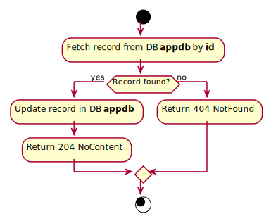

# UpdateBook

## Purpose
Updates an existing book.

## Endpoint
PUT /api/books/{id}

## Parameters
id (GUID) + body: title, author, publishedYear, isbn.

## Examples
- Input: Examples/UpdateBook/Input.md
- Output: Examples/UpdateBook/Output.md

## Responses
- Success: 204 No Content
- Failure: 404 Not Found

## Algorithm

