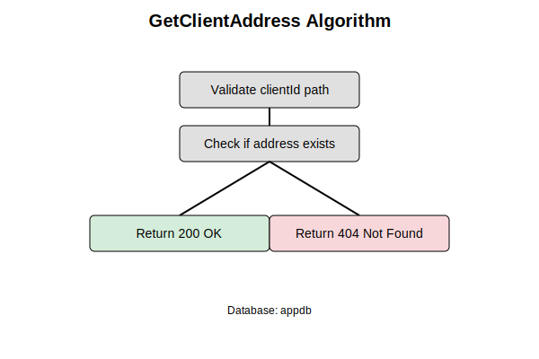

# GetClientAddress

## Purpose
Retrieves the address for a specific client.

## Endpoint
GET /api/clients/{clientId}/addresses

## Parameters
Path: clientId.

## Examples
- Input: Examples/GetClientAddress/Input.md
- Output: Examples/GetClientAddress/Output.md

## Responses
- Success: 200 OK
- Failure: 404 Not Found

## Algorithm

