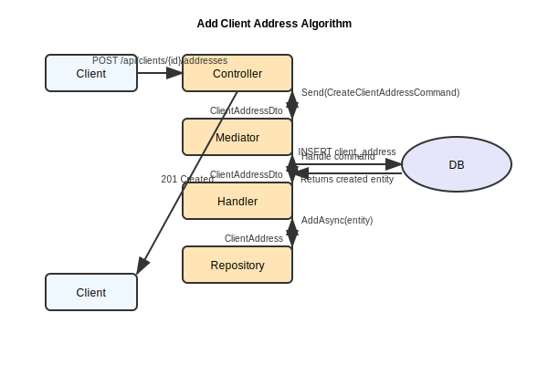

# AddClientAddress

## Purpose
Adds a new address for a client.

## Endpoint
POST /api/clients/{id}/addresses

## Parameters
Body: city, country, address, postalCode.

## Examples
- Input: Examples/AddClientAddress/Input.md
- Output: Examples/AddClientAddress/Output.md

## Responses
- Success: 201 Created
- Failure: 400 Bad Request
- Not Found: 404 Client not found

## Algorithm

