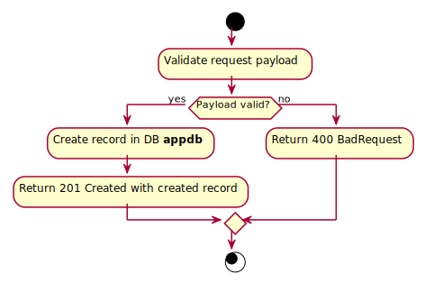

# CreateClientAddress

## Purpose
Creates a new address for a client.

## Endpoint
POST /api/clients/addresses

## Parameters
Body: clientId, city, country, address, postalCode.

## Examples
- Input: Examples/CreateClientAddress/Input.md
- Output: Examples/CreateClientAddress/Output.md

## Responses
- Success: 201 Created
- Failure: 400 Bad Request

## Algorithm

