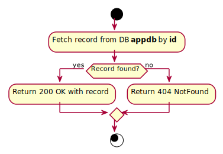

# GetClientById

## Purpose
Returns one client by identifier.

## Endpoint
GET /api/clients/{id}

## Parameters
id (GUID): client identifier.

## Examples
- Input: Examples/GetClientById/Input.md
- Output: Examples/GetClientById/Output.md

## Responses
- Success: 200 OK
- Failure: 404 Not Found

## Algorithm

