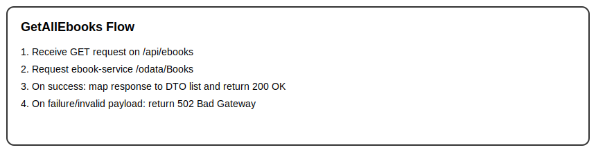

# GetAllEbooks

## Purpose
Returns all books from the external e-book OData catalog.

## Endpoint
GET /api/ebooks

## Parameters
No parameters.

## Examples
- Input: Examples/GetAllEbooks/Input.md
- Output: Examples/GetAllEbooks/Output.md

## Responses
- Success: 200 OK
- Failure: 502 Bad Gateway (external e-book service unavailable or invalid payload)

## Algorithm

