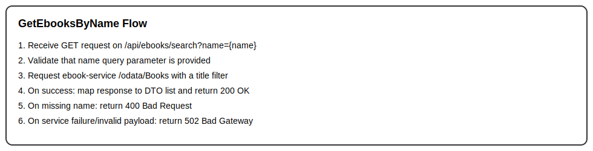

# GetEbooksByName

## Purpose
Searches the external e-book OData catalog by book name.

## Endpoint
GET /api/ebooks/search?name={name}

## Parameters
- `name` (query, required): Book title or part of the title.

## Examples
- Input: Examples/GetEbooksByName/Input.md
- Output: Examples/GetEbooksByName/Output.md

## Responses
- Success: 200 OK
- Validation failure: 400 Bad Request (missing `name`)
- Failure: 502 Bad Gateway (external e-book service unavailable or invalid payload)

## Algorithm

