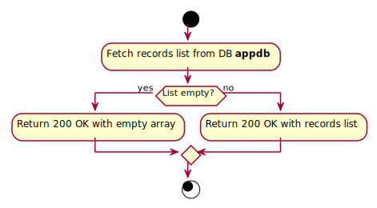

# GetAllJournals

## Purpose
Returns all journals.

## Endpoint
GET /api/journals

## Parameters
No route or query parameters.

## Examples
- Input: Examples/GetAllJournals/Input.md
- Output: Examples/GetAllJournals/Output.md

## Responses
- Success: 200 OK
- Failure: 500 Internal Server Error

## Algorithm

