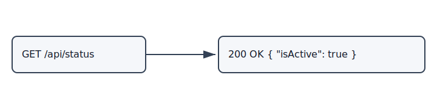

# Get Status

## Purpose
Returns service availability status.

## Endpoint
- Method: `GET`
- Route: `/api/status`

## Parameters
None.

## Response
`200 OK`

```json
{
  "isActtive": true
}
```

## Diagrams


## Examples
- Input: `./Examples/GetStatus/Input.md`
- Output: `./Examples/GetStatus/Output.md`
