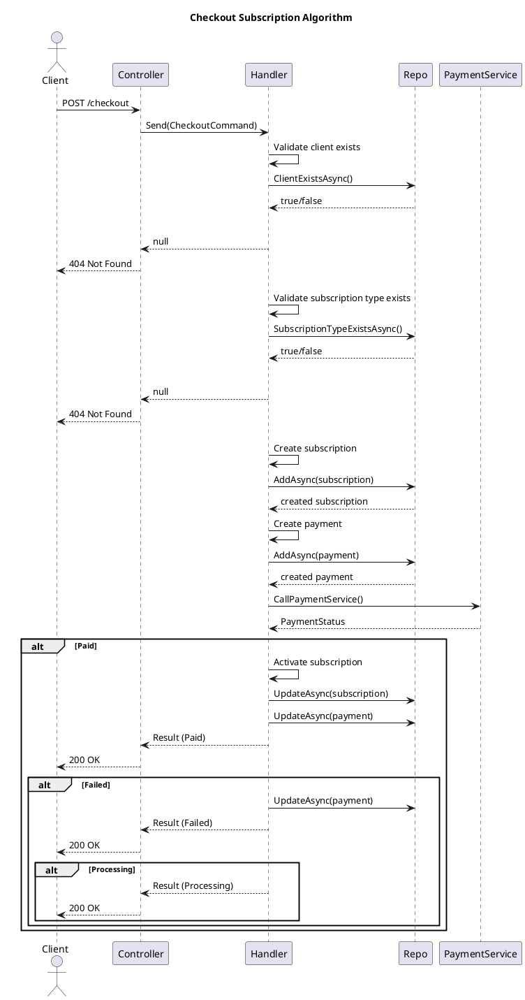

# Checkout Subscription

Creates a new subscription and initiates payment processing.

## Purpose

This endpoint allows clients to checkout and subscribe to a subscription type. The process involves:
1. Validating the client and subscription type exist
2. Creating a new subscription (inactive initially)
3. Creating a payment record
4. Calling the external PaymentService
5. Updating subscription/payment based on payment result

## Request

### Endpoint

```
POST /api/subscriptions/checkout
```

### Headers

```
Content-Type: application/json
```

### Request Body

| Field | Type | Required | Description |
|-------|------|----------|-------------|
| subscriptionTypeId | GUID | Yes | The ID of the subscription type to subscribe to |
| clientId | GUID | Yes | The ID of the client subscribing |
| idempotencyKey | string | Yes | Unique key for idempotent payment processing |

### Example Request

```json
{
  "subscriptionTypeId": "11b6338c-272e-1b16-d98c-05396dc10dc6",
  "clientId": "a1b2c3d4-e5f6-7890-abcd-ef1234567890",
  "idempotencyKey": "pay-12345"
}
```

## Response

### Success Response (200 OK)

| Field | Type | Description |
|-------|------|-------------|
| subscriptionId | GUID | The ID of the created subscription |
| paymentStatus | string | The current status of the payment (Paid, Failed, Processing) |

### Example Response (Payment Success)

```json
{
  "subscriptionId": "f47ac10b-58cc-4372-a567-0e02b2c3d479",
  "paymentStatus": "Paid"
}
```

### Example Response (Payment Failed)

```json
{
  "subscriptionId": "f47ac10b-58cc-4372-a567-0e02b2c3d479",
  "paymentStatus": "Failed"
}
```

### Error Response (404 Not Found)

Returned when the subscription type or client is not found.

```json
{
  "type": "https://tools.ietf.org/html/rfc7231#section-6.5.4",
  "title": "Not Found",
  "status": 404,
  "detail": "Subscription type or client was not found."
}
```

## Payment Status Values

- `Paid` - Payment was successful, subscription is now active
- `Failed` - Payment failed, subscription remains inactive
- `Processing` - Payment is being processed, subscription remains inactive

## Idempotency

The `idempotencyKey` ensures that repeated requests with the same key will not create duplicate payments. The system checks for existing payments with the same unique ID and returns the existing payment status.

## Algorithm




