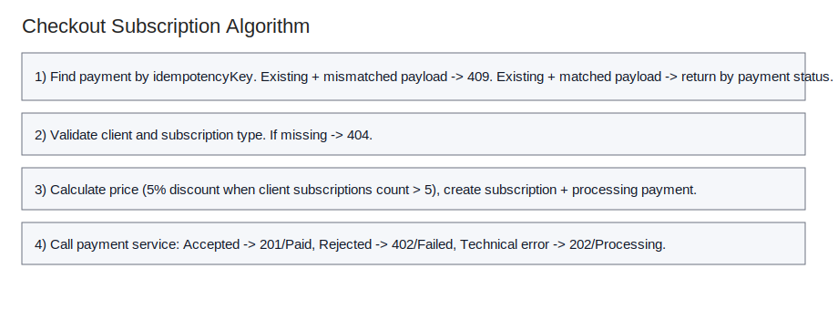

# CheckoutSubscription

## Purpose
Processes subscription payment and creates a new subscription.

## Endpoint
POST /api/subscriptions/checkout

## Parameters
Body: subscriptionTypeId, clientId.

## Examples
- Input: Examples/CheckoutSubscription/Input.md
- Output: Examples/CheckoutSubscription/Output.md

## Responses
- Success: 200 OK
- Failure: 404 Not Found

## Algorithm

