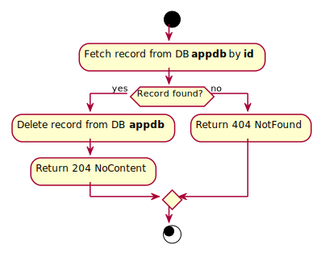

# DeleteSubscriptionType

## Purpose
Deletes subscription type by identifier.

## Endpoint
DELETE /api/subscriptions/types/{id}

## Parameters
id (GUID): subscription type identifier.

## Examples
- Input: Examples/DeleteSubscriptionType/Input.md
- Output: Examples/DeleteSubscriptionType/Output.md

## Responses
- Success: 204 No Content
- Failure: 404 Not Found

## Algorithm

