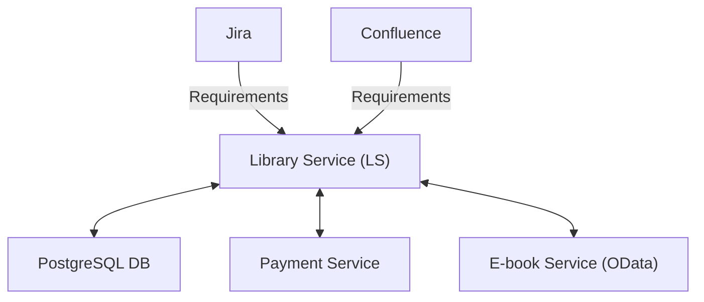

---
layout: cover
---

# AI Agent Comparison

Codex from ChatGPT vs Alfagen based on Qwen3 Coder 30B

- Source of truth: git branches + commit prompts + response files
- Snapshot date: 2026-02-27

---
layout: section
---

# Evaluation Rules

---

## Context Schema

---

## YES / NO Logic

Each action result is evaluated with these rules:

1. `YES` only if the response summary indicates the action was completed.
1. If `/app` has code changes in that branch, `dotnet build app/LibraryService.sln` must pass with `0` errors.
1. If build fails for code-changing branches, result is `NO`.
1. Missing branch for an action is `NO` for that action.

---
layout: section
---

# Action Slides

---
layout: two-cols
---

## Action: `project-structure`

### Codex
- Branch: `codex-gpt5.3-medium/project-structure`
- Summary: Clear layered module walkthrough (`Api`, `Application`, `Domain`, `Infrastructure`, tests, compose).
- `/app` code changes: `no`
- Result: `YES`

::right::

### Qwen
- Branch: `qwen3-coder-30b/project-structure`
- Summary: Correct project and module overview with API and DB notes.
- `/app` code changes: `no`
- Result: `YES`

---
layout: two-cols
---

## Action: `build`

### Codex
- Branch: `codex-gpt5.3-medium/build`
- Summary: Reported build success, `0` errors, `8` warnings.
- `/app` code changes: `no`
- Result: `YES`

::right::

### Qwen
- Branch: `qwen3-coder-30b/build`
- Summary: Reported successful build with vulnerability warnings in test dependencies.
- `/app` code changes: `no`
- Result: `YES`

---
layout: two-cols
---

## Action: `rename-method`

### Codex
- Branch: `codex-gpt5.3-medium/rename-method`
- Summary: Renamed `FindBooksByNameAsync` to `FindBooksAsync` across interface, implementation, handlers, and tests.
- Build check: `YES` (`Build succeeded`, `0` errors)
- Result: `YES`

::right::

### Qwen
- Branch: `qwen3-coder-30b/rename-method`
- Summary: Same rename implemented across interface, service, handlers, unit/integration tests.
- Build check: `YES` (`Build succeeded`, `0` errors)
- Result: `YES`

---
layout: two-cols
---

## Action: `implement-aaa-in-tests`

### Codex
- Branch: `codex-gpt5.3-medium/implement-aaa-in-tests`
- Summary: Converted tests to explicit Arrange/Act/Assert structure and reported passing tests.
- Build check: `YES` (`Build succeeded`, `0` errors)
- Result: `YES`

::right::

### Qwen
- Branch: `qwen3-coder-30b/implement-aaa-in-tests`
- Summary: Fixed test compile issue (`It.IsAny<CancellationToken>()`) and reported passing tests.
- Build check: `YES` (`Build succeeded`, `0` errors)
- Result: `YES`

---
layout: two-cols
---

## Action: `add-status-endpoint`

### Codex
- Branch: `codex-gpt5.3-medium/add-status-endpoint`
- Summary: Added `GET /api/status`, DTO, docs, tests.
- Build check: `YES` (`Build succeeded`, `0` errors)
- Result: `YES`

::right::

### Qwen
- Branch: `qwen3-coder-30b/add-status-endpoint`
- Summary: Response is exploration transcript and does not show completed status endpoint delivery.
- Build check: `NO` (`Build FAILED`, `6` errors)
- Key failures: missing repository methods (`CS1061`) + UTF-8 BOM rule (`LSUTF8BOM001`)
- Result: `NO`

---
layout: two-cols
---

## Action: `add-status-endpoint-base/add-business-logic`

### Codex
- Branch: `codex-gpt5.3-medium/add-status-endpoint-base/add-business-logic`
- Summary: Updated status behavior and tests/docs with business logic in application flow.
- Build check: `YES` (`Build succeeded`, `0` errors)
- Result: `YES`

::right::

### Qwen
- Branch: `qwen3-coder-30b/add-status-endpoint-base/add-business-logic`
- Summary: Response is exploratory transcript and does not show completed implementation.
- Build check: `NO` (`Build FAILED`, `6` errors)
- Key failures: missing repo methods (`CS1061`) + BOM encoding rule (`LSUTF8BOM001`)
- Result: `NO`

---
layout: two-cols
---

## Action: `add-client-address-entity`

### Codex
- Branch: `codex-gpt5.3-medium/add-client-address-entity`
- Summary: Implemented `ClientAddress` entity, endpoint, migration scripts, docs, tests.
- Build check: `YES` (`Build succeeded`, `0` errors)
- Result: `YES`

::right::

### Qwen
- Branch: `qwen3-coder-30b/add-client-address-entity`
- Summary: Response is mostly step-by-step work log; completion quality is not reliable.
- Build check: `NO` (`Build FAILED`, `1` error)
- Key failure: `ClientAddress.cs` encoding rule (`LSUTF8BOM001`)
- Result: `NO`

---
layout: two-cols
---

## Action: `add-client-address-entity-try-2`

### Codex
- Branch: `N/A`
- Summary: No matching Codex retry branch for this action.
- Result: `NO` (no branch)

::right::

### Qwen
- Branch: `qwen3-coder-30b/add-client-address-entity-try-2`
- Summary: Second attempt logged, but delivery remains incomplete.
- Build check: `NO` (`Build FAILED`, `2` errors)
- Key failures: missing `Client` type references (`CS0246`)
- Result: `NO`

---
layout: two-cols
---

## Action: `vulnerabilities`

### Codex
- Branch: `codex-gpt5.3-medium/vulnerabilities`
- Summary: Structured findings by severity with concrete fixes (auth, CORS, secrets, HTTP usage, dependency risks).
- `/app` code changes: `no`
- Result: `YES`

::right::

### Qwen
- Branch: `qwen3-coder-30b/vulnerabilities`
- Summary: Vulnerability assessment with proposed fixes (CORS, input validation and other hardening items).
- `/app` code changes: `no`
- Result: `YES`

---
layout: section
---

# Agent Summaries

---

## Codex Summary

- Evaluated branches: `8`
- `YES`: `8`
- `NO`: `0`
- Code-changing branches: `5`
- Build pass on code-changing branches: `5 / 5`

Outcome: consistent completion with build-clean outputs on all implementation tasks.

---

## Alfagen (Qwen3 Coder 30B) Summary

- Evaluated branches: `9`
- `YES`: `5`
- `NO`: `4`
- Code-changing branches: `6`
- Build pass on code-changing branches: `2 / 6`

Main blockers on failed branches:
- Compile errors (`CS1061`, `CS0246`)
- Encoding policy violations (`LSUTF8BOM001`)
- Incomplete action responses for endpoint/business-logic tasks

---
layout: end
---

# Final Comparison

- Codex had higher action completion and stronger build reliability in this snapshot.
- Alfagen had useful analysis-style responses, but several implementation branches did not build.

Next step: automate this scoring with a script that parses branch metadata + build results.
