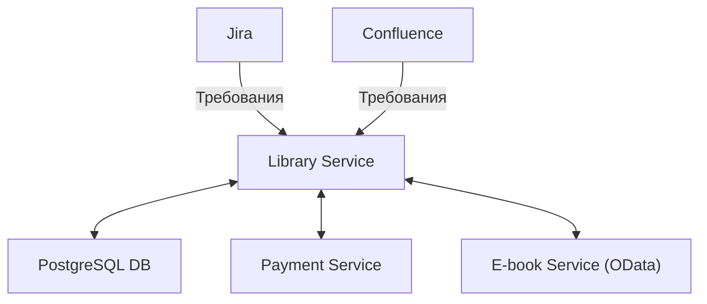

---
layout: cover
---

# Сравнение ИИ-агентов

- ChatGPT Codex
- Alfaget Copilot Qwen3 Coder 30b
- Alfaget Copilot Qwen3 Coder Next
- QA automation agent

---

## Абстрактная типовая среда
 

---

## Структура проекта

  
⌄ app

  
⌄ src

  
⌄ LibraryService.Api

  
› ApiDocs

  
› Controllers

  
› Properties

  
› LibraryService.Application

  
› LibraryService.Domain

  
⌄ LibraryService.Infrastructure

  
› Connected Services

  
⌄ Database

  
› Configurations

  
› ManualScripts

  
› Migrations

  
› Repositories

  
› Services

  
› test

---

<h2 class="slide-title-center">Сборка проекта</h2>

  
<strong>Команда:</strong> <code>Run the build and report the result</code>

  
<strong>Ветка:</strong> <code>{agent}/build</code>

 

<table class="test-case">
  <thead>
    <tr>
      <th>Агент</th>
      <th>Результат</th>
      <th>Комментарии</th>
    </tr>
  </thead>
  <tbody>
    <tr>
      <td>Codex</td>
      <td class="status-success">Успешно</td>
      <td>Есть ветка и response с успешной сборкой.</td>
    </tr>
    <tr>
      <td>Qwen3-Coder-30b</td>
      <td class="status-success">Успешно</td>
      <td>Есть ветка и response с успешной сборкой.</td>
    </tr>
    <tr>
      <td>Qwen3-Coder-Next</td>
      <td class="status-negative">Отрицательно</td>
      <td>Нет ветки в истории сравнения.</td>
    </tr>
    <tr>
      <td>Qa Automation Agent</td>
      <td class="status-negative">Отрицательно</td>
      <td>Ветка для этого кейса отсутствует.</td>
    </tr>
  </tbody>
</table>

---

<h2 class="slide-title-center">Структура проекта</h2>

  
<strong>Команда:</strong> <code>Project Structure Overview</code>

  
<strong>Ветка:</strong> <code>{agent}/project-structure</code>

 

<table class="test-case">
  <thead>
    <tr>
      <th>Агент</th>
      <th>Результат</th>
      <th>Комментарии</th>
    </tr>
  </thead>
  <tbody>
    <tr>
      <td>Codex</td>
      <td class="status-success">Успешно</td>
      <td>Есть ветка и обзор слоистой структуры проекта.</td>
    </tr>
    <tr>
      <td>Qwen3-Coder-30b</td>
      <td class="status-success">Успешно</td>
      <td>Есть ветка и корректное описание модулей.</td>
    </tr>
    <tr>
      <td>Qwen3-Coder-Next</td>
      <td class="status-negative">Отрицательно</td>
      <td>Нет ветки в истории сравнения.</td>
    </tr>
    <tr>
      <td>Qa Automation Agent</td>
      <td class="status-success">Успешно</td>
      <td>Есть ветка и ответ с обзором структуры репозитория.</td>
    </tr>
  </tbody>
</table>

---

<h2 class="slide-title-center">Переименование метода</h2>

  
<strong>Команда:</strong> <code>Rename FindBooksByNameAsync to FindBooksAsync</code>

  
<strong>Ветка:</strong> <code>{agent}/rename-method</code>

 

<table class="test-case">
  <thead>
    <tr>
      <th>Агент</th>
      <th>Результат</th>
      <th>Комментарии</th>
    </tr>
  </thead>
  <tbody>
    <tr>
      <td>Codex</td>
      <td class="status-success">Успешно</td>
      <td>Есть ветка, переименование выполнено по всему коду.</td>
    </tr>
    <tr>
      <td>Qwen3-Coder-30b</td>
      <td class="status-success">Успешно</td>
      <td>Есть ветка, переименование выполнено в коде и тестах.</td>
    </tr>
    <tr>
      <td>Qwen3-Coder-Next</td>
      <td class="status-negative">Отрицательно</td>
      <td>Нет ветки в истории сравнения.</td>
    </tr>
    <tr>
      <td>Qa Automation Agent</td>
      <td class="status-partial">Частично</td>
      <td>Нашел все места использования, но запросил подтверждение и не завершил изменения.</td>
    </tr>
  </tbody>
</table>

---

<h2 class="slide-title-center">AAA в тестах</h2>

  
<strong>Команда:</strong> <code>Implement Arrange Act Assert pattern in tests</code>

  
<strong>Ветка:</strong> <code>{agent}/implement-aaa-in-tests</code>

 

<table class="test-case">
  <thead>
    <tr>
      <th>Агент</th>
      <th>Результат</th>
      <th>Комментарии</th>
    </tr>
  </thead>
  <tbody>
    <tr>
      <td>Codex</td>
      <td class="status-success">Успешно</td>
      <td>Есть ветка, AAA-паттерн внедрен и отражен в response.</td>
    </tr>
    <tr>
      <td>Qwen3-Coder-30b</td>
      <td class="status-partial">Частично</td>
      <td>Есть ветка, но prompt смещен в сторону проверки build/tests, а не только AAA.</td>
    </tr>
    <tr>
      <td>Qwen3-Coder-Next</td>
      <td class="status-negative">Отрицательно</td>
      <td>Нет ветки в истории сравнения.</td>
    </tr>
    <tr>
      <td>Qa Automation Agent</td>
      <td class="status-partial">Частично</td>
      <td>Есть ветка и заявление о рефакторинге, но без полной верификации результата.</td>
    </tr>
  </tbody>
</table>

---

<h2 class="slide-title-center">Status endpoint</h2>

  
<strong>Команда:</strong> <code>add status endpoint that returns GetStatusResponseDto object with fields { IsActtive }</code>

  
<strong>Ветка:</strong> <code>{agent}/add-status-endpoint</code>

 

<table class="test-case">
  <thead>
    <tr>
      <th>Агент</th>
      <th>Результат</th>
      <th>Комментарии</th>
    </tr>
  </thead>
  <tbody>
    <tr>
      <td>Codex</td>
      <td class="status-success">Успешно</td>
      <td>Есть ветка, endpoint добавлен и описан в response.</td>
    </tr>
    <tr>
      <td>Qwen3-Coder-30b</td>
      <td class="status-negative">Отрицательно</td>
      <td>Ветка есть, но prompt не соответствует кейсу и реализация не доведена.</td>
    </tr>
    <tr>
      <td>Qwen3-Coder-Next</td>
      <td class="status-negative">Отрицательно</td>
      <td>Нет ветки в истории сравнения.</td>
    </tr>
    <tr>
      <td>Qa Automation Agent</td>
      <td class="status-partial">Частично</td>
      <td>Есть ветка, но агент остановился на уточняющих вопросах.</td>
    </tr>
  </tbody>
</table>

---

<h2 class="slide-title-center">Бизнес-логика в Application</h2>

  
<strong>Команда:</strong> <code>business logic should be in Application layer</code>

  
<strong>Ветка:</strong> <code>{agent}/add-status-endpoint-base/add-business-logic</code>

 

<table class="test-case">
  <thead>
    <tr>
      <th>Агент</th>
      <th>Результат</th>
      <th>Комментарии</th>
    </tr>
  </thead>
  <tbody>
    <tr>
      <td>Codex</td>
      <td class="status-success">Успешно</td>
      <td>Есть ветка, логика вынесена в Application и кейс продолжен отдельным шагом.</td>
    </tr>
    <tr>
      <td>Qwen3-Coder-30b</td>
      <td class="status-negative">Отрицательно</td>
      <td>Есть ветка, но response показывает незавершенную реализацию.</td>
    </tr>
    <tr>
      <td>Qwen3-Coder-Next</td>
      <td class="status-negative">Отрицательно</td>
      <td>Нет ветки в истории сравнения.</td>
    </tr>
    <tr>
      <td>Qa Automation Agent</td>
      <td class="status-negative">Отрицательно</td>
      <td>Ветка для этого кейса отсутствует.</td>
    </tr>
  </tbody>
</table>

---

<h2 class="slide-title-center">Новая сущность ClientAddress</h2>

  
<strong>Команда:</strong> <code>add a new entity ClientAddress {Id, ClientId, City, Country, Address, PostalCode} and a new endpoint to add it</code>

  
<strong>Ветка:</strong> <code>{agent}/add-client-address-entity</code>

 

<table class="test-case">
  <thead>
    <tr>
      <th>Агент</th>
      <th>Результат</th>
      <th>Комментарии</th>
    </tr>
  </thead>
  <tbody>
    <tr>
      <td>Codex</td>
      <td class="status-success">Успешно</td>
      <td>Есть ветка, добавлены сущность, endpoint и сопутствующие изменения.</td>
    </tr>
    <tr>
      <td>Qwen3-Coder-30b</td>
      <td class="status-negative">Отрицательно</td>
      <td>Есть ветка, но результат выглядит незавершенным и нестабильным.</td>
    </tr>
    <tr>
      <td>Qwen3-Coder-Next</td>
      <td class="status-negative">Отрицательно</td>
      <td>Нет ветки в истории сравнения.</td>
    </tr>
    <tr>
      <td>Qa Automation Agent</td>
      <td class="status-negative">Отрицательно</td>
      <td>Ветка для этого кейса отсутствует.</td>
    </tr>
  </tbody>
</table>

---

<h2 class="slide-title-center">Повторная попытка ClientAddress</h2>

  
<strong>Команда:</strong> <code>add a new entity ClientAddress {Id, ClientId, City, Country, Address, PostalCode} and a new endpoint to add it</code>

  
<strong>Ветка:</strong> <code>{agent}/add-client-address-entity-try-2</code>

 

<table class="test-case">
  <thead>
    <tr>
      <th>Агент</th>
      <th>Результат</th>
      <th>Комментарии</th>
    </tr>
  </thead>
  <tbody>
    <tr>
      <td>Codex</td>
      <td class="status-negative">Отрицательно</td>
      <td>У Codex нет retry-ветки для этого кейса.</td>
    </tr>
    <tr>
      <td>Qwen3-Coder-30b</td>
      <td class="status-partial">Частично</td>
      <td>Есть повторная попытка, но отдельная retry-ветка не закрывает кейс полностью.</td>
    </tr>
    <tr>
      <td>Qwen3-Coder-Next</td>
      <td class="status-negative">Отрицательно</td>
      <td>Нет ветки в истории сравнения.</td>
    </tr>
    <tr>
      <td>Qa Automation Agent</td>
      <td class="status-negative">Отрицательно</td>
      <td>Ветка для этого кейса отсутствует.</td>
    </tr>
  </tbody>
</table>

---

<h2 class="slide-title-center">Анализ уязвимостей</h2>

  
<strong>Команда:</strong> <code>analyze vulnerabilities, propose a fix</code>

  
<strong>Ветка:</strong> <code>{agent}/vulnerabilities</code>

 

<table class="test-case">
  <thead>
    <tr>
      <th>Агент</th>
      <th>Результат</th>
      <th>Комментарии</th>
    </tr>
  </thead>
  <tbody>
    <tr>
      <td>Codex</td>
      <td class="status-success">Успешно</td>
      <td>Есть ветка и структурированный список рисков с предложенными исправлениями.</td>
    </tr>
    <tr>
      <td>Qwen3-Coder-30b</td>
      <td class="status-success">Успешно</td>
      <td>Есть ветка и анализ уязвимостей с рекомендациями.</td>
    </tr>
    <tr>
      <td>Qwen3-Coder-Next</td>
      <td class="status-negative">Отрицательно</td>
      <td>Нет ветки в истории сравнения.</td>
    </tr>
    <tr>
      <td>Qa Automation Agent</td>
      <td class="status-success">Успешно</td>
      <td>Есть ветка и перечисление проблем безопасности в каталоге /app.</td>
    </tr>
  </tbody>
</table>

---

<h2 class="slide-title-center">Реализация Jira issue</h2>

  
<strong>Команда:</strong> <code>get jira ISSUE DEMO-18 and create implementation plan -&gt; Implement, on step 3 just replace the method</code>

  
<strong>Ветка:</strong> <code>{agent}/implement-jira-issue</code>

 

<table class="test-case">
  <thead>
    <tr>
      <th>Агент</th>
      <th>Результат</th>
      <th>Комментарии</th>
    </tr>
  </thead>
  <tbody>
    <tr>
      <td>Codex</td>
      <td class="status-partial">Частично</td>
      <td>Есть ветка, issue получен из Jira и составлен план, но завершение реализации не зафиксировано.</td>
    </tr>
    <tr>
      <td>Qwen3-Coder-30b</td>
      <td class="status-negative">Отрицательно</td>
      <td>Нет ветки в истории сравнения.</td>
    </tr>
    <tr>
      <td>Qwen3-Coder-Next</td>
      <td class="status-negative">Отрицательно</td>
      <td>Нет ветки в истории сравнения.</td>
    </tr>
    <tr>
      <td>Qa Automation Agent</td>
      <td class="status-negative">Отрицательно</td>
      <td>Ветка для этого кейса отсутствует.</td>
    </tr>
  </tbody>
</table>

---

<h2 class="slide-title-center">Сводная матрица</h2>

<table class="test-case summary-matrix">
  <thead>
    <tr>
      <th>Кейс</th>
      <th>ChatGPT Codex</th>
      <th>Qwen3 Coder 30b</th>
      <th>Qwen3 Coder Next</th>
      <th>QA Automation Agent</th>
    </tr>
  </thead>
  <tbody>
    <tr>
      <td>Сборка</td>
      <td class="status-success">Успешно</td>
      <td class="status-success">Успешно</td>
      <td class="status-negative">Отрицательно</td>
      <td class="status-negative">Отрицательно</td>
    </tr>
    <tr>
      <td>Структура проекта</td>
      <td class="status-success">Успешно</td>
      <td class="status-success">Успешно</td>
      <td class="status-negative">Отрицательно</td>
      <td class="status-success">Успешно</td>
    </tr>
    <tr>
      <td>Переименование метода</td>
      <td class="status-success">Успешно</td>
      <td class="status-success">Успешно</td>
      <td class="status-negative">Отрицательно</td>
      <td class="status-partial">Частично</td>
    </tr>
    <tr>
      <td>AAA в тестах</td>
      <td class="status-success">Успешно</td>
      <td class="status-partial">Частично</td>
      <td class="status-negative">Отрицательно</td>
      <td class="status-partial">Частично</td>
    </tr>
    <tr>
      <td>Status endpoint</td>
      <td class="status-success">Успешно</td>
      <td class="status-negative">Отрицательно</td>
      <td class="status-negative">Отрицательно</td>
      <td class="status-partial">Частично</td>
    </tr>
    <tr>
      <td>Логика в Application</td>
      <td class="status-success">Успешно</td>
      <td class="status-negative">Отрицательно</td>
      <td class="status-negative">Отрицательно</td>
      <td class="status-negative">Отрицательно</td>
    </tr>
    <tr>
      <td>ClientAddress</td>
      <td class="status-success">Успешно</td>
      <td class="status-negative">Отрицательно</td>
      <td class="status-negative">Отрицательно</td>
      <td class="status-negative">Отрицательно</td>
    </tr>
    <tr>
      <td>ClientAddress retry</td>
      <td class="status-negative">Отрицательно</td>
      <td class="status-partial">Частично</td>
      <td class="status-negative">Отрицательно</td>
      <td class="status-negative">Отрицательно</td>
    </tr>
    <tr>
      <td>Анализ уязвимостей</td>
      <td class="status-success">Успешно</td>
      <td class="status-success">Успешно</td>
      <td class="status-negative">Отрицательно</td>
      <td class="status-success">Успешно</td>
    </tr>
    <tr>
      <td>Реализация Jira issue</td>
      <td class="status-partial">Частично</td>
      <td class="status-negative">Отрицательно</td>
      <td class="status-negative">Отрицательно</td>
      <td class="status-negative">Отрицательно</td>
    </tr>
  </tbody>
</table>

