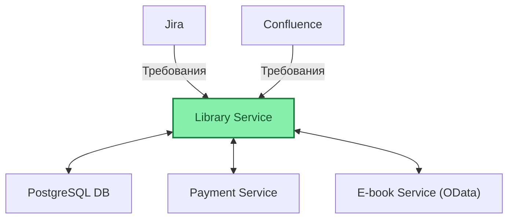

# Сравнение ИИ агентов

**Автор:** Кульмухаметов М.М.

**Команда:** УТК-2

---

<h2 class="slide-title-center">Участники сравнения</h2>

<table class="test-case">
  <thead>
    <tr>
      <th>Агент</th>
      <th>Информация</th>
    </tr>
  </thead>
  <tbody>
    <tr>
      <td>ChatGPT Codex</td>
      <td>https://developers.openai.com/codex/quickstart/</td>
    </tr>
    <tr>
      <td>Qwen3 Coder 30b - Alfagen Copilot</td>
      <td rowspan="2">Инструкция по IDE-плагину для Пользователей https://confluence.moscow.alfaintra.net/pages/viewpage.action?pageId=2128941831</td>
    </tr>
    <tr>
      <td>Qwen3 Coder Next - Alfagen Copilot</td>
    </tr>
    <tr>
      <td>Qwen3 Coder Next - Kilo</td>
      <td rowspan="2">Инструкция по установке Kilo Сode https://confluence.moscow.alfaintra.net/pages/viewpage.action?pageId=3153282540</td>
    </tr>
    <tr>
      <td>GLM 5 - Kilo</td>
    </tr>
    <tr>
      <td>QA automation agent</td>
      <td>ИИ агент для генерации кода автотестов https://confluence.moscow.alfaintra.net/pages/viewpage.action?pageId=3043890467</td>
    </tr>
  </tbody>
</table>

---
class: text-center vm-slide
---

<h2 class="slide-title-center">Окружение</h2>
 

---

<h2 class="slide-title-center">Структура проекта</h2>

  

    
⌄ app

    
⌄ src

    
⌄ LibraryService.Api

    
› ApiDocs

    
› Controllers

    
› Properties

    
› LibraryService.Application

    
› LibraryService.Domain

    
⌄ LibraryService.Infrastructure

    
› Connected Services

    
⌄ Database

    
› Configurations

    
› ManualScripts

    
› Migrations

    
› Repositories

    
› Services

    
› test

  

  

    
Описание

    
Framework: .net Core 8.0

    
LibraryService.Api: контроллеры и документация.

    
LibraryService.Application: бизнес локига 

    
LibraryService.Domain: а доменные сущности

    
LibraryService.Infrastructure: содержит интеграции, доступ к данным и миграции PostgreSQL. 

    
app/test: Тесты 

    
Допольнительно

    
Добавлен синтаксический анализатор, который проверяет кодировку файлов, должна быть UTF-8 BOM

  

---

<h2 class="slide-title-center">Кейсы сравнения</h2>

  

    
1. Структура проекта

    
Показывает, насколько агент понимает архитектуру, границы слоев и может быстро построить корректную модель системы.

  

  

    
2. Сборка проекта

    
Проверяет базовую самостоятельность агента: запустить инструменты, корректно интерпретировать результат.

  

  

    
3. Переименование метода

    
Показывает аккуратность точечных изменений, работу с зависимостями и дисциплину при валидации результата.

  

  

    
4. Реализация AAA в тестах

    
Проверяет качество работы с тестовым кодом, понимание структуры тестов.

  

  

  
5. Добавление эндпоинта Status

    
Оценивает способность реализовать полный API-изменение: код, контракты, документацию и согласованность по слоям.

  

  

    
6. Добавление логики для эндпоинта Status

    
Показывает, умеет ли агент держать архитектурные правила, работать с тестами.

  

  

    
7. Добавление новой сущности ClientAddress и эндпоинта

    
Проверяет работу на более широком vertical slice: доменная модель, слой хранения данных, API, миграции, тесты и связность изменений.

  

  

    
8. Работа над простой задачей из Jira

    
Оценивает способность агента работать с внешними требованиями, извлекать контекст из Atlassian и превращать его в план и реализацию.

  

  

    
9. Работа над сложной задачей из Jira

    
Показывает, как агент ведет многосоставную задачу: анализ требований, декомпозиция, реализация, интеграции и контроль технического качества результата.

  

  

    
10. Анализ уязвимостей

    
Показывает глубину инженерного мышления агента вне кодогенерации: поиск рисков, приоритизация и практичность предлагаемых исправлений.

  

---

<h2 class="slide-title-center">Структура проекта</h2>

  
<strong>Команда:</strong> <code>Project Structure Overview</code>

  
<strong>Ветка:</strong> <code>{agent}/project-structure</code>

 

<table class="test-case">
  <thead>
    <tr>
      <th>Агент</th>
      <th>Результат</th>
      <th>Комментарии</th>
    </tr>
  </thead>
  <tbody>
    <tr>
      <td>Codex</td>
      <td class="status-success">Успешно</td>
      <td>краткий, но содержательный обзор структуры проекта.</td>
    </tr>
    <tr>
      <td>Qwen3-Coder-30b</td>
      <td class="status-success">Успешно</td>
      <td>сформировано детальное и точное описание проекта.</td>
    </tr>
    <tr>
      <td>Qwen3-Coder-Next</td>
      <td class="status-success">Успешно</td>
      <td>дан подробный ответ, покрывающий основные аспекты проекта.</td>
    </tr>
    <tr>
      <td>Kilo-Qwen3-Coder-Next</td>
      <td class="status-success">Успешно</td>
      <td>агент предоставил качественное описание структуры проекта.</td>
    </tr>
    <tr>
      <td>Kilo-GLM-5</td>
      <td class="status-success">Успешно</td>
      <td>агент предоставил качественное описание структуры проекта.</td>
    </tr>
    <tr>
      <td>Qa Automation Agent</td>
      <td class="status-passed-partial">Успешно/Частично</td>
      <td>агент смог описать репозиторий, но работал нестабильно и испытывал проблемы с подключением.</td>
    </tr>
  </tbody>
</table>

---

<h2 class="slide-title-center">Сборка проекта</h2>

  
<strong>Команда:</strong> <code>Run the build and report the result</code>

  
<strong>Ветка:</strong> <code>{agent}/build</code>

 

<table class="test-case">
  <thead>
    <tr>
      <th>Агент</th>
      <th>Результат</th>
      <th>Комментарии</th>
    </tr>
  </thead>
  <tbody>
    <tr>
      <td>Codex</td>
      <td class="status-success">Успешно</td>
      <td>агент успешно выполнил сборку проекта.</td>
    </tr>
    <tr>
      <td>Qwen3-Coder-30b</td>
      <td class="status-partial">Частично</td>
      <td>сборка была выполнена, но потребовалось ручное подтверждение.</td>
    </tr>
    <tr>
      <td>Qwen3-Coder-Next</td>
      <td class="status-partial">Частично</td>
      <td>сборка завершилась успешно, но запуск терминального инструмента требовал ручного подтверждения.</td>
    </tr>
    <tr>
      <td>Kilo-Qwen3-Coder-Next</td>
      <td class="status-success">Успешно</td>
      <td>агент успешно выполнил сборку проекта.</td>
    </tr>
    <tr>
      <td>Kilo-GLM-5</td>
      <td class="status-success">Успешно</td>
      <td>агент выполнил сборку проекта и вывел предупреждения.</td>
    </tr>
    <tr>
      <td>Qa Automation Agent</td>
      <td class="status-negative">Отрицательно</td>
      <td class="long-comment">агент сообщил, что не может выполнять shell-команды, предложил только альтернативные шаги и не выполнил сборку.</td>
    </tr>
  </tbody>
</table>

---

<h2 class="slide-title-center">Переименование метода</h2>

  
<strong>Команда:</strong> <code>Rename FindBooksByNameAsync to FindBooksAsync</code>

  
<strong>Ветка:</strong> <code>{agent}/rename-method</code>

 

<table class="test-case">
  <thead>
    <tr>
      <th>Агент</th>
      <th>Результат</th>
      <th>Комментарии</th>
    </tr>
  </thead>
  <tbody>
    <tr>
      <td>Codex</td>
      <td class="status-success">Успешно</td>
      <td>метод переименован корректно, проверка сборки прошла успешно.</td>
    </tr>
    <tr>
      <td>Qwen3-Coder-30b</td>
      <td class="status-passed-partial">Успешно/Частично</td>
      <td>метод переименован корректно, хотя тесты не запускались.</td>
    </tr>
    <tr>
      <td>Qwen3-Coder-Next</td>
      <td class="status-partial">Частично</td>
      <td class="long-comment">метод был переименован, сборка и тесты прошли, но потребовалось 10-15 ручных подтверждений для запуска терминальных инструментов. Агент несколько раз удалял несвязанный код, затем обнаружил ошибку и откатил изменения.</td>
    </tr>
    <tr>
      <td>Kilo-Qwen3-Coder-Next</td>
      <td class="status-success">Успешно</td>
      <td>агент переименовал метод и проверил сборку; тесты не запускались.</td>
    </tr>
    <tr>
      <td>Kilo-GLM-5</td>
      <td class="status-success">Успешно</td>
      <td>агент переименовал метод, выполнил сборку проекта и запустил тесты.</td>
    </tr>
    <tr>
      <td>Qa Automation Agent</td>
      <td class="status-partial-negative">Частично/Отрицательно</td>
      <td class="long-comment">агент понял задачу и сделал часть изменений, но не довел до конца; заявлял о прохождении тестов с некорректными данными, каждое изменение требовало ручного подтверждения.</td>
    </tr>
  </tbody>
</table>

---

<h2 class="slide-title-center">Реализация AAA в тестах</h2>

  
<strong>Команда:</strong> <code>Implement Arrange Act Assert pattern in tests</code>

  
<strong>Ветка:</strong> <code>{agent}/implement-aaa-in-tests</code>

 

<table class="test-case">
  <thead>
    <tr>
      <th>Агент</th>
      <th>Результат</th>
      <th>Комментарии</th>
    </tr>
  </thead>
  <tbody>
    <tr>
      <td>Codex</td>
      <td class="status-success">Успешно</td>
      <td>тесты были обновлены, после чего проверены сборка и прохождение тестов.</td>
    </tr>
    <tr>
      <td>Qwen3-Coder-30b</td>
      <td class="status-negative">Отрицательно</td>
      <td>сборка падала из-за проблем с кодировкой; затем часть тестов была удалена.</td>
    </tr>
    <tr>
      <td>Qwen3-Coder-Next</td>
      <td class="status-negative">Отрицательно</td>
      <td>агент удалял тесты, чтобы добиться успешного результата, и в итоге завершился с ошибкой.</td>
    </tr>
    <tr>
      <td>Kilo-Qwen3-Coder-Next</td>
      <td class="status-success">Успешно</td>
      <td>агент обновил тесты, запустил их и получил успешный результат.</td>
    </tr>
    <tr>
      <td>Kilo-GLM-5</td>
      <td class="status-success">Успешно</td>
      <td>агент добавил комментарии в тестах, собрал решение и запустил тесты.</td>
    </tr>
    <tr>
      <td>Qa Automation Agent</td>
      <td class="status-negative">Отрицательно</td>
      <td class="long-comment">агент понял требование и предложил план, но не реализовал изменения; пытался убедить, что все тесты уже обновлены.</td>
    </tr>
  </tbody>
</table>

---

<h2 class="slide-title-center">Добавление эндпоинта Status</h2>

  
<strong>Команда:</strong> <code>add status endpoint that returns GetStatusResponseDto object with fields { IsActtive }</code>

  
<strong>Ветка:</strong> <code>{agent}/add-status-endpoint</code>

 

<table class="test-case">
  <thead>
    <tr>
      <th>Агент</th>
      <th>Результат</th>
      <th>Комментарии</th>
    </tr>
  </thead>
  <tbody>
    <tr>
      <td>Codex</td>
      <td class="status-success">Успешно</td>
      <td>эндпоинт, документация, тесты и валидация были выполнены полностью.</td>
    </tr>
    <tr>
      <td>Qwen3-Coder-30b</td>
      <td class="status-partial">Частично</td>
      <td>эндпоинт и документация добавлены, но тесты и диаграммы отсутствуют.</td>
    </tr>
    <tr>
      <td>Qwen3-Coder-Next</td>
      <td class="status-partial">Частично</td>
      <td>эндпоинт и документация добавлены, сборка прошла, но потребовались повторные попытки и ручные подтверждения.</td>
    </tr>
    <tr>
      <td>Kilo-Qwen3-Coder-Next</td>
      <td class="status-passed-partial">Успешно/Частично</td>
      <td>агент добавил эндпоинт и API-документацию, но тесты не были добавлены с первой попытки.</td>
    </tr>
    <tr>
      <td>Kilo-GLM-5</td>
      <td class="status-partial">Частично</td>
      <td>агент добавил эндпоинт, но не добавил тесты и документацию.</td>
    </tr>
    <tr>
      <td>Qa Automation Agent</td>
      <td class="status-partial-negative">Частично/Отрицательно</td>
      <td>агент внес нужные изменения, но не справился с проблемами кодировки.</td>
    </tr>
  </tbody>
</table>

---

<h2 class="slide-title-center">Добавление логики для эндпоинта Status</h2>

  
<strong>Команда:</strong> <code>IsActive  in status response should be true when there are active subscriptions</code>

  
<strong>Ветка:</strong> <code>{agent}/add-status-endpoint-base/add-business-logic</code>

 

<table class="test-case">
  <thead>
    <tr>
      <th>Агент</th>
      <th>Результат</th>
      <th>Комментарии</th>
    </tr>
  </thead>
  <tbody>
    <tr>
      <td>Codex</td>
      <td class="status-success">Успешно</td>
      <td>логика перенесена в слой Application, документация и тесты обновлены, сборка и тесты проверены.</td>
    </tr>
    <tr>
      <td>Qwen3-Coder-30b</td>
      <td class="status-partial">Частично</td>
      <td>после исправления логика была перенесена, но тесты не были добавлены и потребовалось три попытки.</td>
    </tr>
    <tr>
      <td>Qwen3-Coder-Next</td>
      <td class="status-partial">Частично</td>
      <td>существующий обработчик был обновлен, но тесты и документация не были доведены до конца.</td>
    </tr>
    <tr>
      <td>Kilo-Qwen3-Coder-Next</td>
      <td class="status-partial">Частично</td>
      <td>агент добавил логику и создал сервис вместо MediatR; API-документация и тесты не обновлены.</td>
    </tr>
    <tr>
      <td>Kilo-GLM-5</td>
      <td class="status-passed-partial">Успешно/Частично</td>
      <td>агент обновил эндпоинт Status и использовал MediatR, но не добавил тесты и не обновил документацию.</td>
    </tr>
    <tr>
      <td>Qa Automation Agent</td>
      <td class="status-no-data">Нет данных</td>
      <td>Нет данных по этому кейсу.</td>
    </tr>
  </tbody>
</table>

---

<h2 class="slide-title-center">Добавление новой сущности ClientAddress и эндпоинта</h2>

  
<strong>Команда:</strong> <code>add a new entity ClientAddress {Id, ClientId, City, Country, Address, PostalCode} and a new endpoint to add it</code>

  
<strong>Ветка:</strong> <code>{agent}/add-client-address-entity</code>

 

<table class="test-case">
  <thead>
    <tr>
      <th>Агент</th>
      <th>Результат</th>
      <th>Комментарии</th>
    </tr>
  </thead>
  <tbody>
    <tr>
      <td>Codex</td>
      <td class="status-success">Успешно</td>
      <td>добавлены сущность, логика, документация, миграции и тесты; тесты были проверены.</td>
    </tr>
    <tr>
      <td>Qwen3-Coder-30b</td>
      <td class="status-partial">Частично</td>
      <td>агент создал хороший стартовый результат, но не довел задачу до конца.</td>
    </tr>
    <tr>
      <td>Qwen3-Coder-Next</td>
      <td class="status-partial">Частично</td>
      <td>основная часть работы была выполнена, но на финальном шаге агент завис и завершился с ошибкой.</td>
    </tr>
    <tr>
      <td>Kilo-Qwen3-Coder-Next</td>
      <td class="status-passed-partial">Успешно/Частично</td>
      <td class="long-comment">агент добавил сущность, репозиторий и обновил базу данных, следовал правилам по миграциям, но не добавил тесты и зациклился на ошибках при попытке их добавить.</td>
    </tr>
    <tr>
      <td>Kilo-GLM-5</td>
      <td class="status-partial">Частично</td>
      <td>агент создал сущность, репозиторий и новый эндпоинт, но не добавил миграции, тесты и API-документацию.</td>
    </tr>
    <tr>
      <td>Qa Automation Agent</td>
      <td class="status-no-data">Нет данных</td>
      <td>Нет данных по этому кейсу.</td>
    </tr>
  </tbody>
</table>

---

<h2 class="slide-title-center">Работа над простой задачей из Jira</h2>

  
<strong>Команда:</strong> <code>get jira ISSUE DEMO-18 and create implementation plan</code>

  
<strong>Ветка:</strong> <code>{agent}/implement-jira-issue</code>

 

<table class="test-case">
  <thead>
    <tr>
      <th>Агент</th>
      <th>Результат</th>
      <th>Комментарии</th>
    </tr>
  </thead>
  <tbody>
    <tr>
      <td>Codex</td>
      <td class="status-success">Успешно</td>
      <td>задача и связанные страницы были изучены, план составлен, изменения реализованы и проверены.</td>
    </tr>
    <tr>
      <td>Qwen3-Coder-30b</td>
      <td class="status-negative">Отрицательно</td>
      <td>агент получил задачу, но не понял требуемый объем реализации.</td>
    </tr>
    <tr>
      <td>Qwen3-Coder-Next</td>
      <td class="status-negative">Отрицательно</td>
      <td>данные из Jira и Confluence были получены, но план остался неясным, а требования были интерпретированы неверно.</td>
    </tr>
    <tr>
      <td>Kilo-Qwen3-Coder-Next</td>
      <td class="status-negative">Отрицательно</td>
      <td>агент смог получить данные из Jira и Confluence, но неверно понял требования.</td>
    </tr>
    <tr>
      <td>Kilo-GLM-5</td>
      <td class="status-partial">Частично</td>
      <td>агент понял задачу и реализовал код, но не обновил API-документацию и не добавил тесты.</td>
    </tr>
    <tr>
      <td>Qa Automation Agent</td>
      <td class="status-no-data">Нет данных</td>
      <td>Нет данных по этому кейсу.</td>
    </tr>
  </tbody>
</table>

---

<h2 class="slide-title-center">Работа над сложной задачей из Jira</h2>

  
<strong>Команда:</strong> <code>Get jira issue DEMO-19, create implementation plan</code>

  
<strong>Ветка:</strong> <code>{agent}/plan-and-implement-complex-jira-issue</code>

 

<table class="test-case">
  <thead>
    <tr>
      <th>Агент</th>
      <th>Результат</th>
      <th>Комментарии</th>
    </tr>
  </thead>
  <tbody>
    <tr>
      <td>Codex</td>
      <td class="status-success">Успешно</td>
      <td class="long-comment">агент уточнил спорные требования по идемпотентности, кодам ответа и настройке валюты, после чего успешно реализовал задачу.</td>
    </tr>
    <tr>
      <td>Qwen3-Coder-30b</td>
      <td class="status-no-data">Нет данных</td>
      <td>Нет данных по этому кейсу.</td>
    </tr>
    <tr>
      <td>Qwen3-Coder-Next</td>
      <td class="status-no-data">Нет данных</td>
      <td>Нет данных по этому кейсу.</td>
    </tr>
    <tr>
      <td>Kilo-Qwen3-Coder-Next</td>
      <td class="status-partial-negative">Частично/Отрицательно</td>
      <td class="long-comment">план минимальный, реализация базовая, тесты отсутствуют, интеграция платежного сервиса имитируется, есть проблемы с идемпотентностью и расчетом цены.</td>
    </tr>
    <tr>
      <td>Kilo-GLM-5</td>
      <td class="status-partial">Частично</td>
      <td class="long-comment">план и реализация созданы, но без тестов; документация эндпоинта не полностью соответствует коду, идемпотентность реализована минималистично.</td>
    </tr>
    <tr>
      <td>Qa Automation Agent</td>
      <td class="status-no-data">Нет данных</td>
      <td>Нет данных по этому кейсу.</td>
    </tr>
  </tbody>
</table>

---

<h2 class="slide-title-center">Анализ уязвимостей</h2>

  
<strong>Команда:</strong> <code>analyze vulnerabilities, propose a fix</code>

  
<strong>Ветка:</strong> <code>{agent}/vulnerabilities</code>

 

<table class="test-case">
  <thead>
    <tr>
      <th>Агент</th>
      <th>Результат</th>
      <th>Комментарии</th>
    </tr>
  </thead>
  <tbody>
    <tr>
      <td>Codex</td>
      <td class="status-success">Успешно</td>
      <td>выявлен путь с наивысшим риском и предложен способ его устранения.</td>
    </tr>
    <tr>
      <td>Qwen3-Coder-30b</td>
      <td class="status-success">Успешно</td>
      <td>предоставлены подробные и применимые рекомендации по безопасности.</td>
    </tr>
    <tr>
      <td>Qwen3-Coder-Next</td>
      <td class="status-success">Успешно</td>
      <td>сформированы применимые рекомендации по безопасности с конкретными исправлениями.</td>
    </tr>
    <tr>
      <td>Kilo-Qwen3-Coder-Next</td>
      <td class="status-success">Успешно</td>
      <td>агент подготовил детальный отчет об уязвимостях в коде.</td>
    </tr>
    <tr>
      <td>Kilo-GLM-5</td>
      <td class="status-success">Успешно</td>
      <td>агент подготовил подробный отчет об уязвимостях и рекомендации по исправлению.</td>
    </tr>
    <tr>
      <td>Qa Automation Agent</td>
      <td class="status-success">Успешно</td>
      <td>агент смог найти уязвимости, но несколько раз неожиданно прекращал работу.</td>
    </tr>
  </tbody>
</table>

---

<h2 class="slide-title-center">Сводная матрица</h2>

<table class="test-case summary-matrix">
  <thead>
    <tr>
      <th>Кейс</th>
      <th>ChatGPT Codex</th>
      <th>Qwen3 Coder 30b</th>
      <th>Qwen3 Coder Next</th>
      <th>Kilo Qwen3 Coder Next</th>
      <th>Kilo GLM 5</th>
      <th>QA Automation Agent</th>
    </tr>
  </thead>
  <tbody>
    <tr>
      <td>Структура проекта</td>
      <td class="status-success">Успешно</td>
      <td class="status-success">Успешно</td>
      <td class="status-success">Успешно</td>
      <td class="status-success">Успешно</td>
      <td class="status-success">Успешно</td>
      <td class="status-passed-partial">Успешно/Частично</td>
    </tr>
    <tr>
      <td>Сборка проекта</td>
      <td class="status-success">Успешно</td>
      <td class="status-partial">Частично</td>
      <td class="status-partial">Частично</td>
      <td class="status-success">Успешно</td>
      <td class="status-success">Успешно</td>
      <td class="status-negative">Отрицательно</td>
    </tr>
    <tr>
      <td>Переименование метода</td>
      <td class="status-success">Успешно</td>
      <td class="status-passed-partial">Успешно/Частично</td>
      <td class="status-partial">Частично</td>
      <td class="status-success">Успешно</td>
      <td class="status-success">Успешно</td>
      <td class="status-partial-negative">Частично/Отрицательно</td>
    </tr>
    <tr>
      <td>Реализация AAA в тестах</td>
      <td class="status-success">Успешно</td>
      <td class="status-negative">Отрицательно</td>
      <td class="status-negative">Отрицательно</td>
      <td class="status-success">Успешно</td>
      <td class="status-success">Успешно</td>
      <td class="status-negative">Отрицательно</td>
    </tr>
    <tr>
      <td>Добавление эндпоинта Status</td>
      <td class="status-success">Успешно</td>
      <td class="status-partial">Частично</td>
      <td class="status-partial">Частично</td>
      <td class="status-passed-partial">Успешно/Частично</td>
      <td class="status-partial">Частично</td>
      <td class="status-partial-negative">Частично/Отрицательно</td>
    </tr>
    <tr>
      <td>Добавление логики для эндпоинта Status</td>
      <td class="status-success">Успешно</td>
      <td class="status-partial">Частично</td>
      <td class="status-partial">Частично</td>
      <td class="status-partial">Частично</td>
      <td class="status-passed-partial">Успешно/Частично</td>
      <td class="status-no-data">Нет данных</td>
    </tr>
    <tr>
      <td>Добавление новой сущности ClientAddress и эндпоинта</td>
      <td class="status-success">Успешно</td>
      <td class="status-partial">Частично</td>
      <td class="status-partial">Частично</td>
      <td class="status-passed-partial">Успешно/Частично</td>
      <td class="status-partial">Частично</td>
      <td class="status-no-data">Нет данных</td>
    </tr>
    <tr>
      <td>Работа над простой задачей из Jira</td>
      <td class="status-success">Успешно</td>
      <td class="status-negative">Отрицательно</td>
      <td class="status-negative">Отрицательно</td>
      <td class="status-negative">Отрицательно</td>
      <td class="status-partial">Частично</td>
      <td class="status-no-data">Нет данных</td>
    </tr>
    <tr>
      <td>Работа над сложной задачей из Jira</td>
      <td class="status-success">Успешно</td>
      <td class="status-no-data">Нет данных</td>
      <td class="status-no-data">Нет данных</td>
      <td class="status-partial-negative">Частично/Отрицательно</td>
      <td class="status-partial">Частично</td>
      <td class="status-no-data">Нет данных</td>
    </tr>
    <tr>
      <td>Анализ уязвимостей</td>
      <td class="status-success">Успешно</td>
      <td class="status-success">Успешно</td>
      <td class="status-success">Успешно</td>
      <td class="status-success">Успешно</td>
      <td class="status-success">Успешно</td>
      <td class="status-success">Успешно</td>
    </tr>
  </tbody>
</table>

---
class: text-center
---

<h2 class="slide-title-center">Выводы</h2>

  

    
ChatGPT Codex

    
ChatGPT Codex: Высокая степень автономности, анализует существующие подходы проекта и пытается их применить. Максимально пытается довести изменения до рабочего состояния. Хорошо понимает контекст задачи. В сложных случаях может подсветить проблемные места: пробелы в требованиях, потенциальные проблемы с кодом.

  

  

    
Alfagen Copilot Qwen3 Coder 30b

    
Alfagen Copilot Qwen3 Coder 30b : Быстрая модель, хорошо проводит аналитическую работу. Уверенно справляется с небольшими задачами, но требует детальной постановки задачи. Есть склонность к преждевременному завершению работы и отчете об успешном исполнении. Существенное ограничение - необходимость ручного подтверждения терминальных команд. Часто возникают ошибки связанные с вызовом различных инструментов, терминальные команды, работа с файлами. Переодически возникают проблемы со стабильностью.

  

  

    
Alfagen Copilot Qwen3 Coder Next

    
Alfagen Copilot Qwen3 Coder Next примерно аналогично Qwen3 Coder 30b.

  

  

    
Kilo Qwen3 Coder Next

    
Kilo Qwen3 Coder Next: Агент решает большинство проблем связанных с туллингом в Alfagen. Может работать автономно, но для достижения необходимого результата требуются корректировки.

  

  

    
Kilo GLM 5

    
Kilo GLM 5 : Немного "умнее", чем Qwen3 Coder Next.

  

  

    
QA Automation Agent

    
QA Automation Agent: неплохой агент для простых, спотовых задач. Может вносить небольшие правки в открытых файлах. Переодически возникают проблемы со стабильностью.

  

---
layout: center
class: text-center final-thanks-slide
---

# Спасибо за внимание!

  Исходники: <a href="https://github.com/markul/demo-library-service" target="_blank">https://github.com/markul/demo-library-service</a>

